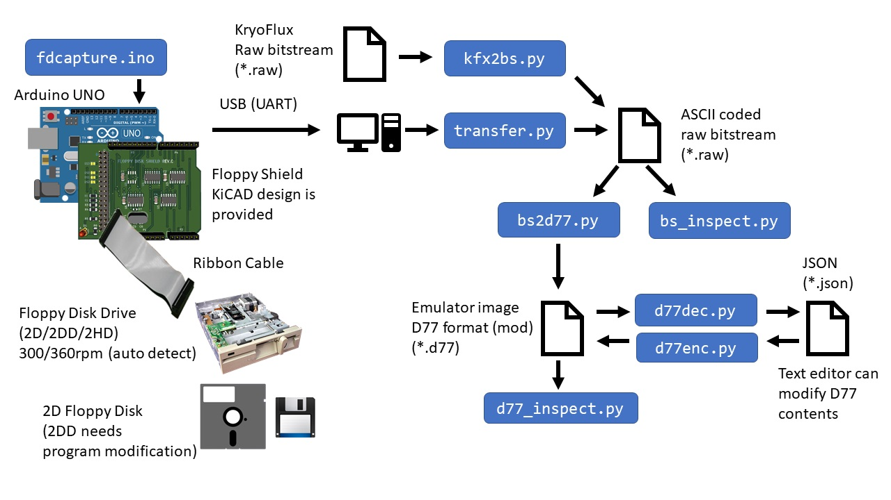
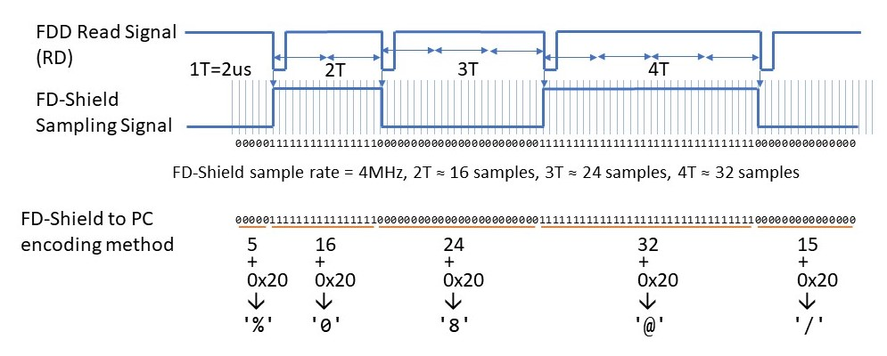
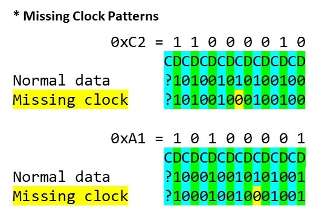
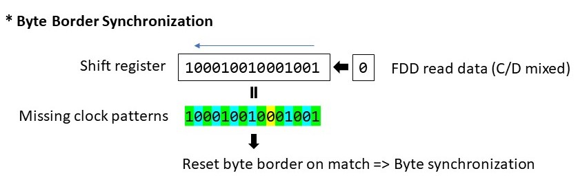

# Floppy Disk Shield for Arduino UNO

## Caveat  
- **The project is still WIP**
- Hardware compatibility (especially, FDD and FD-Shield compatibility) is not guaranteed
- The magnetic flux power on the old floppy disks are dropping and getting weak as time passes. Read-out data integrity with this system is not guaranteed.
- Recommended to use newer FDD. The old FDD may have problem on the magnetic head such as contamination, worn out or mechanical misalignment.

## Description
This is a project to develop a system for preserving old 2D/2DD floppy disk data.  
The system includes a bit-stream data to D77/D88 emulator disk image converter. You can generate the disk images from the phicical floppy disks.  

The system consists with hardware and software:  

**Hardware**  
|Item|Description|
|:----|:----|
|Arduino UNO|Arduino UNO. The firmware uses ATMega328 specific regiter. The other Arduino board may not work|
|Floppy disk shield for Arduino|Design data is included. Both schematics and PCB data are available (`./kicad/*`)|
|Floppy drive|2D/2DD/2HD FDD. 3.5" or 5.25" FDD (+ power supply and ribbon cable). 300rpm drive is recommended but 360rpm 2HD drive will work as a 2DD drive|  

**Software**  

|Name|Description|
|:--------|:-----------|
|`fdcapture.ino`|Arduino firmware (sketch) for the floppy shield (`./fdcapture/fdcapture.ino`)|
|`transfer.py`|Transfers raw bitstream data from Arduino to PC|
|`fdcapture.ino`|Arduino firmware for controlling floppy disk shield|
|`bs2d77.py`|Bit-stream data to emulator disk image (.D77/D88) converter.|
|`bs_inspect.py`|Data inspection/analyze tool for bit-stream data|
|`d77_inspect.py`|Data inspection/analyze tool for D77/D88 disk image data|
|`floppylib.py`|A library which provides fundamental floppy disk functions. This library is including data-separator, digital VFO, MFM decoder and IBM format parser|
|`d77dec.py`|Convert D77/D88 disk image data to JSON (plane text) data|
|`d77enc.py`|Generate D77/D88 disk image data from JSON data|
|`d77lib.py`|A libray which provides basic D77/D88 floppy disk image manipulation functions|
|`kfx2bs.py`|[**KyroFlux**](https://www.kryoflux.com/) raw-bitstream data to fd-shield bit-stream data converter. You can capture FD image with KryoFlux and convert it|

### System Diagram

### FD-Shield - How It Works

---------

## Test Environment

- Windows 10 1909
- Arduino UNO

|FDD|Mfg|FF|Description|
|---|----|----|----|
|FD55-GFR|TEAC|5.25"|2DD/2HD, 360rpm, for DOS/V|
|FD-235HG|TEAC|3.5"|2DD/2HD, 300/(360)rpm, dual-mode?|
|YD-580|YE-Data|5.25"|2D, 300rpm, for FM-7 (1984-11)|
|YD625-1525|YE-Data|3.5"|2D, 300rpm, for FM-77|

