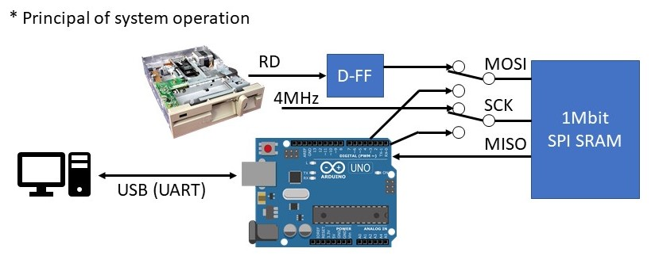
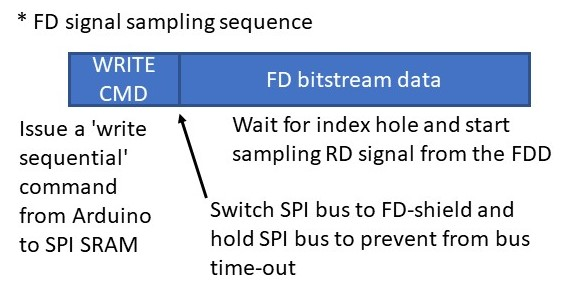
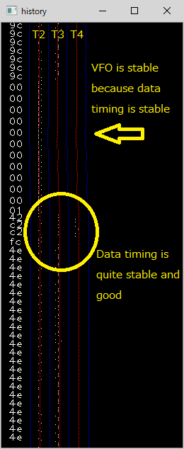
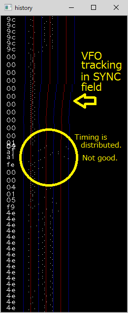
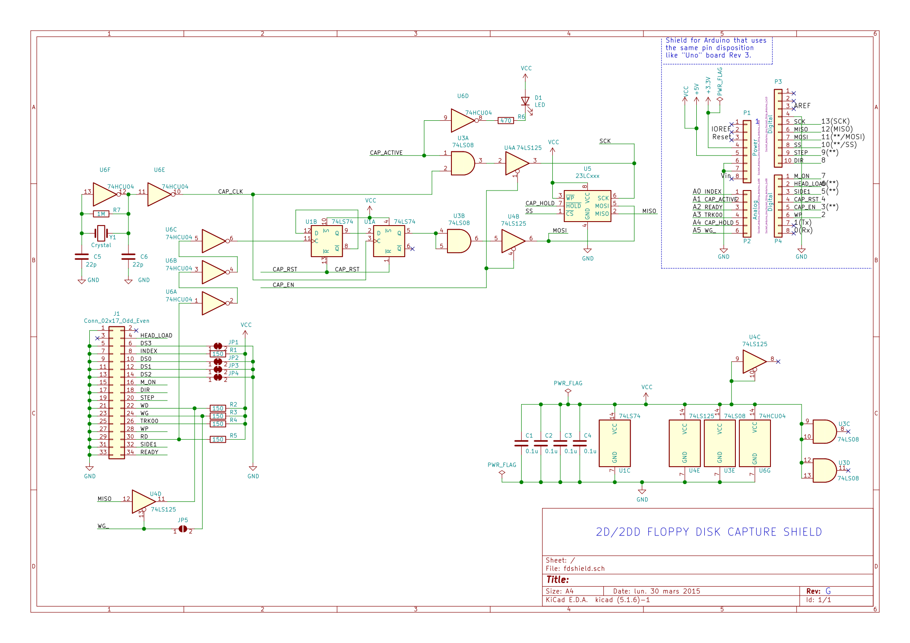
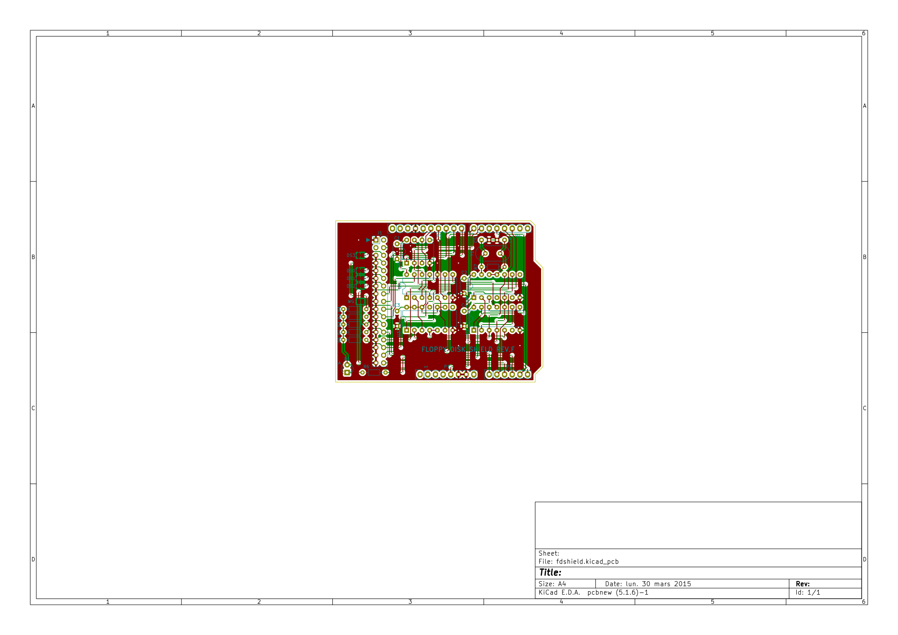

# Floppy Disk Shield for Arduino UNO

## Caveat and Disclaimer - Read before you build a fd-shield  
- **The project is still WIP**
- I don't own any responsibility for the data loss or physical damage on your floppy disks or computer assets caused by the use of hardware and software included in this project.
- Hardware compatibility (especially, FDD and FD-Shield compatibility) is not guaranteed. Your FDD may now work with the FD-Shield.  
- The magnetic flux power on the old floppy disks are dropping and getting weak as time passes. Read-out data integrity with this system is not guaranteed.
- Recommended to use newer FDD. The old FDD may have problems on the magnetic head such as contamination, worn out or mechanical misalignment.

## Description
This is a project to develop a system for preserving old 2D/2DD floppy disk data.  
The system can preserve entire floppy disk data regardless whether it's normal or not. That means the system can read and preserve copy protect information in the bit-stream file as it is.  
The recorded bit-stream file can be decoded and restore the contents anytime later.  
The system includes a bit-stream data to D77/D88 emulator disk image converter. You can read the floppy disk with this tool and generate the disk images.  
これは古い2D/2DDフロッピーディスクのデータを保存するためのシステムを作るプロジェクトです。  
このシステムを使うことで仕様にのっとった正しい信号も非正規の信号も全てそのまま保存することが可能です。つまり、このシステムではコピープロテクトのための情報まで含めてビットストリームデータとして保存することが可能です。  
記録されたビットストリームデータは後でデコード、解読を行うことで情報を取り出すことが可能です。  
このシステムにはビットストリームデータからエミュレータ互換のイメージファイル(D77/D88)を生成するためのコンバーターも含んでいます。実際のフロッピーを読み取り、ディスクイメージを生成することが可能です。  

The system consists of the hardware and software:  
システムはハードウエアとソフトウエアから構成されます:

**Hardware**  
|Item|Description|
|:----|:----|
|Arduino UNO|Arduino UNO. The firmware uses ATMega328 specific regiter. The other Arduino board may not work|
|Floppy disk shield for Arduino|Design data is included. Both schematics and PCB data are available (`./kicad/*`)<br>Rev.A design has bugs. Rev.B and beyond are basically comatible and has same function.<br>KiCAD用のPCBの設計データも提供されています(./kicad/*)<br>Rev.A and Rev.Fにはバグがあります。Rev.B以降は基本的に同じ機能です|
|Floppy disk drive|2D/2DD/2HD FDD. 3.5" or 5.25" FDD (+ power supply and ribbon cable). 300rpm drive is recommended but 360rpm 2HD drive will work as a 2DD drive. The FD-shield can detect the track density (2D or 2DD/2HD, 80 tracks or 160 tracks) and spindle spin speed (300rpm or 360rpm)|  

**Software**  

|Name|Description|
|:--------|:-----------|
|[`fdcapture.ino`](./docs/fdcapture_ino.md)|Arduino firmware (sketch) for the floppy shield<br> (`./fdcapture/fdcapture.ino`)|
|[`transfer.py`](./docs/transfer.md)|Transfers raw bitstream data from Arduino to a PC|
|[`bs2d77.py`](./docs/bs2d77.md)|Bit-stream data to emulator disk image (D77/D88) converter.<br> The program generates modified D77 image data (D77mod). D77mod specification is [here](docs/D77mod_format.md). The D77mod uses some reserved bytes in the header but it is designed to keep backward compatibility with the standard D77 disk images. The D77mod image should work with emulators which supports regular D77/D88 disk images.|
|[`bs_inspect.py`](./docs/bs_inspect.md)|Data inspection/analyze tool for bit-stream data|
|[`d77_inspect.py`](./docs/d77_inspect.md)|Data inspection/analyze tool for D77/D88 disk image data|
|`floppylib.py`|A library which provides fundamental floppy disk functions.<br> This library is including data-separator, digital VFO, MFM decoder and IBM format parser|
|`d77dec.py`|Convert a D77/D88 disk image data to a JSON (plane text) file|
|`d77enc.py`|Generate a D77/D88 disk image data from a JSON file|
|`d77lib.py`|A libray which provides basic D77/D88 floppy disk image manipulation functions|
|[`kfx2bs.py`](./docs/kfx2bs.md)|[**KyroFlux**](https://www.kryoflux.com/) raw-bitstream data to fd-shield bit-stream data converter. You can capture FD image with KryoFlux and use it.|
### System Diagram


## FD-Shield - How It Works







---------

## Introduction of Features in the Support Tools

* `bs_inspect.py`  
This tool provides featurs to analyze or check the bitstream data and its quality.  
  * Visualize data timing history
  * Visualize data timing histogram
  * Read all IDs in the tracks
  * Read all sectors in the tracks
  * MFM data dump
  * ASCII data dump (display pritable/readable data)
  * Tweak parameters (VFO high/low gain value, sampling frequency, FDD spin speed) 

### Bitstream visualizer


### Bitstream timing histogram viewer
* Good case 
* Bad case - The quality of data is bad. This might be caused by FDD quality (both writing drive and reading drive) and floppy disk media aging (magnetic flux power fading, contamination, etc).

---------

## How to use - 使い方

1. Build Floppy shield for Arduino UNO - シールド製作  
- PCB design files can be found in the `./kicad` directory
2. Burn the floppy disk shield firmware (sketch) to Arduino UNO - Arduio UNOにファームウエアを書き込む  
Use `fdcapture.ino`
3. Assemble the system - システムを接続
- Attach a floppy shield to an Arduino UNO
- Connect a floppy shield and a floppy disk drive with a 36pin ribon cable
- Connect Arduino UNO to PC via USB cable
4. Read raw bit-stream data from a floppy disk - フロッピーからビットストリームデータを生成  
- Insert a 2D floppy disk to the floppy disk drive (FDD) -- 2DD floppy disk can be read but it requires a simple code modification to change head seek method on `fdcapture.ino`.
- Run following command on the Windows PC:
```sh
python transfer.py -o image_name.raw --read_overlap 5
```
- `transfer.py` will search COM port for Arduino UNO and use it.
- `--read_overlap` option specifies how much data to read on the 2nd lap in percent.
5. Convert raw bit-stream data into emulator image data (D77mod) -- ビットストリームからディスクイメージファイルを生成
```sh
python bs2d77.py -i image_name.raw --abort_id
```
- `image_name.d77` will be generated.  
**Note:** The `--abort_id` option enables abort reading track image when the same sector ID is detected. The FD-shield can read the top of the 2nd lap with `--read_overlap` option. This overlapped track data may contain the same sector data twice. This option will prevent from generating the same sector in a track.  

## Current Development Status
**Done:**
- Read floppy disk images (2D disk on 2D drive, 2DD disk on 2D deive, 2D disk on 2DD/2HD drive)
- Drive type auto datection (2D or 2DD/2HD)
- Drive spindle revolution measurement 
- Generates D77mod disk images from the raw bitstream data

**WIP**
- Bug fix

**Known Issues**
- The last data bit in CRC field may be lost. This may cause a ID or Data CRC error.

## Test Environment

- Windows 10 1909
- Arduino UNO
- Floppy disk shield for Arduino
- FDDs (table below)

|P/N|Mfg|FF|Description|
|:----|:----|:----:|:----|
|YD-580 1354|YE-Data|5.25"|2D, 300rpm, for Fujitsu FM-7|
|MD5201|Canon|5.25"|2D, 300rpm|
|FD-55B-01-U 19307110-01|TEAC|5.25"|2D, 300rpm|
|FD55-GFR 19307673-93|TEAC|5.25"|2DD/2HD, 360rpm, for DOS/V|
|YD625-1525|YE-Data|3.5"|2D, 300rpm, for Fujitsu FM-77|
|FD-235HG 19307773-04|TEAC|3.5"|2DD/2HD, 300/360rpm, Fixed to DS1|
|OSD E26J|Citizen|3.5"|2DD/2HD, 300/360rpm, for PX9821Xa?|
|JU-256A236P|Panasonic|3.5"|2DD/2HD, 300/360rpm, for DOS/V|
|FD1231T 134-506790-011-0|NEC|3.5"|2DD/2HD, 300/360rpm, for PC9821|
|DF354H068C|ALPS|3.5"|2DD/2HD, 300/360rpm, for DOS/V|

---------------

## Addendum


### FD-shield - 3D view


### FD-shield - Schematics

[PDF](resources/fdshield-schematics.pdf)

### FD-shield - Board design file


