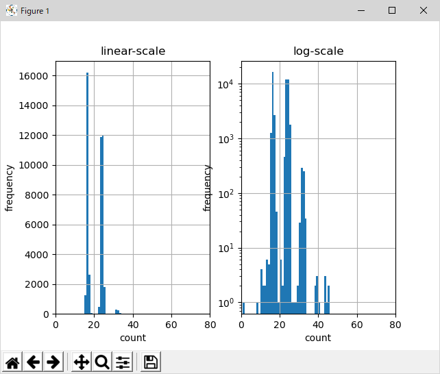

bs_inspect.py


```
** Floppy data capture shield - bit stream data inspect tool
usage: bs_inspect.py [-h] -i INPUT -t TRACK [--high_gain HIGH_GAIN]
                     [--low_gain LOW_GAIN] [--log_level {0,1,2}]
                     [--clk_spd CLK_SPD] [--histogram] [--history]
                     [--mfm_dump] [--ascii_dump] [--id_dump] [--read_sectors]
                     [--abort_index] [--abort_id]

optional arguments:
  -h, --help            show this help message and exit
  -i INPUT, --input INPUT
                        input bitstream file path
  -t TRACK, --track TRACK
                        track number. single number or a tuple (start,end)
                        (track # should be 0-83 for 2D, 0-163 for 2DD)
  --high_gain HIGH_GAIN
                        data separator gain for high-speed tracking mode
                        (default: 1)
  --low_gain LOW_GAIN   data separator gain for low-speed tracking mode
                        (default: 1)
  --log_level {0,1,2}   log level: 0=off, 1=minimum, 2=verbose
  --clk_spd CLK_SPD     FD-shield capture clock speed (default=4MHz=4000000)
  --histogram           display histogram of the pulse interval buffer
  --pulse_pitch         display pulse pitch graph for a track
  --history             display history graph of the pulse interval buffer
  --mfm_dump            display MFM decoded data in HEX dump style
  --ascii_dump          display printable data in the sectors
  --id_dump             display decoded all ID address marks in the track
  --read_sectors        read all sectors in the track and display result
  --abort_index         abort ID reading on 2nd index mark detection
  --abort_id            abort ID reading on 2nd identical ID detection
```


```sh
python bs_inspect.py -i gutchan_bank.raw -t 0 --histogram
```
  

```sh
python bs_inspect.py -i gutchan_bank.raw -t 0 --history
```
`ESC` to quit, `SPACE` to pause scrolling.  
  


```sh
python bs_inspect.py -i disk_img.raw -t 0 --pulse_pitch
```
  
  

```sh
python bs_inspect.py -i gutchan_bank.raw -t 0 --mfm_dump
```
```
** Floppy data capture shield - bit stream data inspect tool
** TRACK  0
7614 (0x1dbe) bytes read
  39  39  39  39  39  39  39  39  39  39  39  39  39  39  39  39  39  39  39  39  39  39  39  39  39  39  39  39  39  39  39  39
  39  39  39  39  39  39  39  39  39  39  39  39  39  39  39  39  39  39  39  39  39  39  39  39  39  39  39  39  39  39  39  39
  39  39  39  39  39  39  39  39  39  39  39  39  38  00  00  00  00  00  00  00  00  00  00  00  03 *02 *C2 *C2  FC  4E  4E  4E
  4E  4E  4E  4E  4E  4E  4E  4E  4E  4E  4E  4E  4E  4E  4E  4E  4E  4E  4E  4E  4E  4E  4E  4E  4E  4E  4E  4E  4E  4E  4E  4E
  4E  4E  4E  4E  4E  4E  4E  4E  4E  4E  4E  4E  4E  4E  4E  00  00  00  00  00  00  00  00  00  00  00  00 *14 *02 *A1 *A1  FE
  00  00  01  01  FA  0C  4E  4E  4E  4E  4E  4E  4E  4E  4E  4E  4E  4E  4E  4E  4E  4E  4E  4E  4E  4E  4E  4E  00  00  00  00
  00  00  00  00  00  00  00  00  00 *14 *02 *A1 *A1  FB  1A  50  10  CE  02  B6  86  FD  1F  8B  86  80  97  1D  8D  68  86  05
  8D  4B  8D  16  86  01  8D  3E  86  0F  8D  25  8E  10  00  BF  01  5D  86  05  BD  01  8C  7E  10  00  8D  4A  86  03  97  18
  21  FE  21  FE  21  FE  21  FE  8D  3C  96  18  85  04  27  EA  39  8D  33  97  1B  8D  2F  86  13  97  18  8D  33  96  18  85
  10  27  02  20  EC  39  8D  1E  97  1C  39  00  00  34  06  CC  00  00  C3  00  01  26  FB  35  06  4A  26  F1  39  34  02 *04
  0E  39  84  80  04  03  CC  1F *C2  0E  33  93  E4  80  0C  03  CC  1F *C2  0E  03  81  FC  80  0C  03  C3  00  02  06  02  0E
  33 *42  7E  47  C9  C1  0E  7F  E1  C1  39  80  33  38  07  F0  01  03  1F  21  07  02  03  C1  C0  FE  40  1E  7F  C1  07  00
  40  7E  78  3E  13  FF  FF  FF  FC  00  00  00  00  00  00  00  00  00  00  00  00  00  00  00  00  00  00  00  00  00  00  00
  00  00  00  00  00  00  00  00  00  00  00  00  00  00  00  00  00  00  00  00  00  00  00  00  00  00  00  00  00  00  00  00
  00  00  00  00  00  00  00  00  00  00  00  00  00  00  05  97  57  F3  93  93  93  93  93  93  93  93  93  93  93  93  93  93
  93  93  93  93  93  93  93  93  93  93  93  93  93  93  93  93  93  93  93  93  93  93  93  93  93  93  93  93  93  93  93  93
  93  80  00  00  00  00  00  00  00  00  00  00  00 *14 *02 *A1 *A1  FE  00  00  02  01  AF  5F  4E  4E  4E  4E  4E  4E  4E  4E
  4E  4E  4E  4E  4E  4E  4E  4E  4E  4E  4E  4E  4E  4E  00  00  00  00  00  00  00  00  00  00  00  00  00 *14 *02 *A1 *A1  FB
  12  12  12  12  12  12  12  12  12  12  12  12  12  12  12  12  12  12  12  12  12  12  12  12  12  12  12  12  12  12  12  12
 ```

 ```sh
 python bs_inspect.py -i putty\fb30.log -t 2 --ascii_dump
```

```
** Floppy data capture shield - bit stream data inspect tool
** TRACK  2
 # : (C ,H ,R ,N ) ID-CRC DT-CRC AM    MFM-POS
 1 : (01,00,01,01) OK     OK     DAM   0x009c
"#$%&'()-124679:;<=>?@BFGHIKLMNO
 # : (C ,H ,R ,N ) ID-CRC DT-CRC AM    MFM-POS
 2 : (01,00,0c,01) OK     OK     DAM   0x0212

 # : (C ,H ,R ,N ) ID-CRC DT-CRC AM    MFM-POS
 3 : (01,00,07,01) OK     OK     DAM   0x0387
ART-O   +WOMAN-D ,TOKEI-D .DEMO-O  /WAKA1-D 0WAKA2-D 3MICKEY  5OEKAKI7 8
 # : (C ,H ,R ,N ) ID-CRC DT-CRC AM    MFM-POS
 4 : (01,00,02,01) OK     OK     DAM   0x04fc

 # : (C ,H ,R ,N ) ID-CRC DT-CRC AM    MFM-POS
 5 : (01,00,0d,01) OK     OK     DAM   0x0671
 ```

```sh
python bs_inspect.py -i gutchan_bank.raw -t 0 --id_dump
```

```
** Floppy data capture shield - bit stream data inspect tool
** TRACK  0
 # : (C ,H ,R ,N ) ID-CRC CRC-val
 1 : (00,00,01,01) OK     0x009f
 2 : (00,00,02,01) OK     0x0211
 3 : (00,00,03,01) OK     0x0383
 4 : (00,00,04,01) OK     0x04f5
 5 : (00,00,05,01) OK     0x0667
 6 : (00,00,06,01) OK     0x07d9
 7 : (00,00,07,01) OK     0x094b
 8 : (00,00,08,01) OK     0x0abd
 9 : (00,00,09,01) OK     0x0c2f
10 : (00,00,0a,01) OK     0x0da1
11 : (00,00,0b,01) OK     0x0f13
12 : (00,00,0c,01) OK     0x1085
13 : (00,00,0d,01) OK     0x11f7
14 : (00,00,0e,01) OK     0x136a
15 : (00,00,0f,01) OK     0x14dc
16 : (00,00,10,01) OK     0x164e
17 : (00,00,01,01) OK     0x1962
18 : (00,00,02,01) OK     0x1ad4
19 : (00,00,03,01) OK     0x1c46
```

```sh
python bs_inspect.py -i gutchan_bank.raw -t 0 --id_dump --abort_index
```
`--abort_index` or `--abort_id`

```
python bs_inspect.py -i gutchan_bank.raw -t (0,3) --read_sectors --abort_index
```

```
** Floppy data capture shield - bit stream data inspect tool
** TRACK  0
 # : (C ,H ,R ,N ) ID-CRC CRC-val
 1 : (00,00,01,01) OK     0x009f
 2 : (00,00,02,01) OK     0x0211
 3 : (00,00,03,01) OK     0x0383
 4 : (00,00,04,01) OK     0x04f5
 5 : (00,00,05,01) OK     0x0667
 6 : (00,00,06,01) OK     0x07d9
 7 : (00,00,07,01) OK     0x094b
 8 : (00,00,08,01) OK     0x0abd
 9 : (00,00,09,01) OK     0x0c2f
10 : (00,00,0a,01) OK     0x0da1
11 : (00,00,0b,01) OK     0x0f13
12 : (00,00,0c,01) OK     0x1085
13 : (00,00,0d,01) OK     0x11f7
14 : (00,00,0e,01) OK     0x136a
15 : (00,00,0f,01) OK     0x14dc
16 : (00,00,10,01) OK     0x164e
```


```sh
python bs_inspect.py -i gutchan_bank.raw -t 0 --read_sectors
```
```
** Floppy data capture shield - bit stream data inspect tool
** TRACK  0
 # : (C ,H ,R ,N ) ID-CRC DT-CRC AM    MFM-POS
 1 : (00,00,01,01) OK     OK     DAM   0x009f
 2 : (00,00,02,01) OK     OK     DAM   0x0211
 3 : (00,00,03,01) OK     OK     DAM   0x0383
 4 : (00,00,04,01) OK     OK     DAM   0x04f5
 5 : (00,00,05,01) OK     OK     DAM   0x0667
 6 : (00,00,06,01) OK     OK     DAM   0x07d9
 7 : (00,00,07,01) OK     OK     DAM   0x094b
 8 : (00,00,08,01) OK     OK     DAM   0x0abd
 9 : (00,00,09,01) OK     OK     DAM   0x0c2f
10 : (00,00,0a,01) OK     OK     DAM   0x0da1
11 : (00,00,0b,01) OK     OK     DAM   0x0f13
12 : (00,00,0c,01) OK     OK     DAM   0x1085
13 : (00,00,0d,01) OK     OK     DAM   0x11f7
14 : (00,00,0e,01) OK     OK     DAM   0x136a
15 : (00,00,0f,01) OK     OK     DAM   0x14dc
16 : (00,00,10,01) OK     OK     DAM   0x164e
17 : (00,00,01,01) OK     OK     DAM   0x1962
18 : (00,00,02,01) OK     OK     DAM   0x1ad4
19 : (00,00,03,01) OK     OK     DAM   0x1c46
OK=19, Error=0
```
